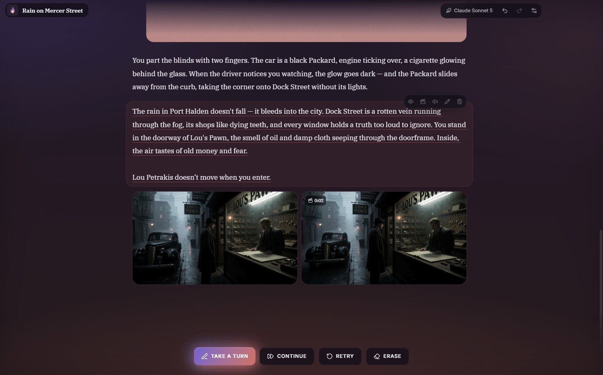
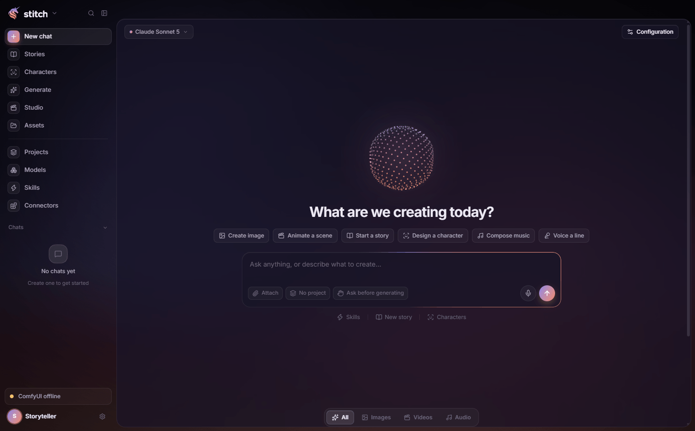
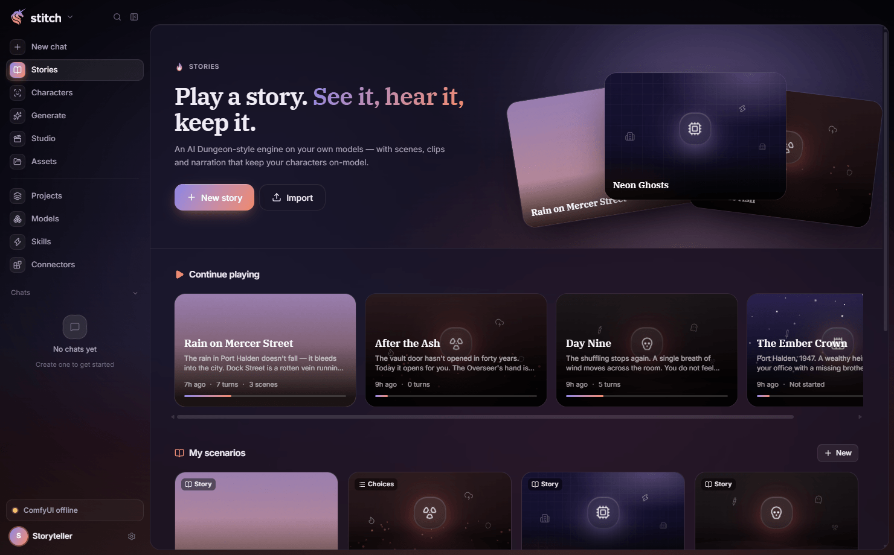
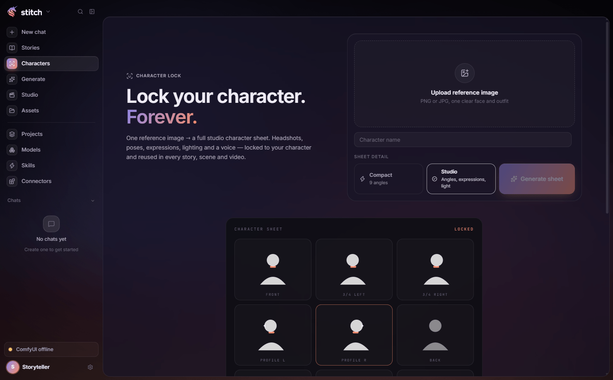
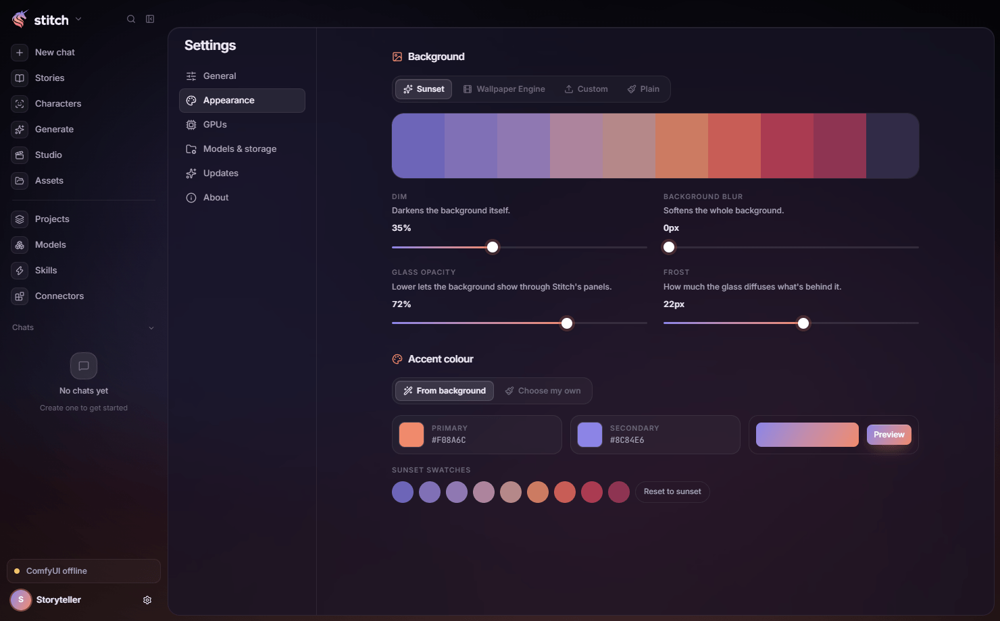

  <picture>
    <source media="(prefers-color-scheme: dark)" srcset="docs/logo-dark.png">
    
  </picture>

<b>Your own AI studio and storyteller, running on your PC.</b>

  <a href="https://github.com/Darker117/stitch/releases/latest"><b>⬇ Download for Windows</b></a>

  

## What is Stitch?

Stitch brings two creative tools together in one desktop app:

- **A studio** for making images, video, music and voices.
- **A story engine** where you play through interactive adventures that illustrate, animate and narrate themselves as you go.

The idea that ties them together is **consistency**. Create a character once and they stay the same everywhere — in every picture, every clip, every voice line and every story you play with them.

Everything is generated locally on your own graphics card, so your characters, stories and creations stay on your machine.

## Download

Get the latest installer from the [**Releases**](https://github.com/Darker117/stitch/releases/latest) page and run `Stitch-Setup-<version>.exe`.

Stitch keeps itself up to date: when a new version comes out it downloads in the background and asks before restarting.

> Windows may show a SmartScreen warning because the installer isn't signed yet. Choose **More info → Run anyway**.

You'll need Windows 10 or 11 and an NVIDIA graphics card.

## Stitch on your phone

The Android app is a remote for Stitch on your PC: chats, stories, characters and generations all run on your graphics card and stay in your library — the phone just drives it, with the same look and every feature.

- **Pair once** — in Stitch on the PC open **Settings → Phone → Pair a phone** and scan the QR code.
- **Use it anywhere** — at home it talks to your PC over Wi-Fi; turn on **Access from anywhere** to keep going on mobile data.
- **Make things on the phone too** — text, images and voice can also run on the phone itself (Qualcomm NPU, GPU or CPU); they land in the same library.

The app lives in [`mobile/`](mobile) (build it with `npm run apk` there).

## A look inside

| | |
|:---:|:---:|
|  Describe what you want to make |  Pick a story and play |
|  Lock a character once, reuse them everywhere |  Make it yours — themes and live wallpapers |

---

Building from source? See [docs/DEVELOPMENT.md](docs/DEVELOPMENT.md).
